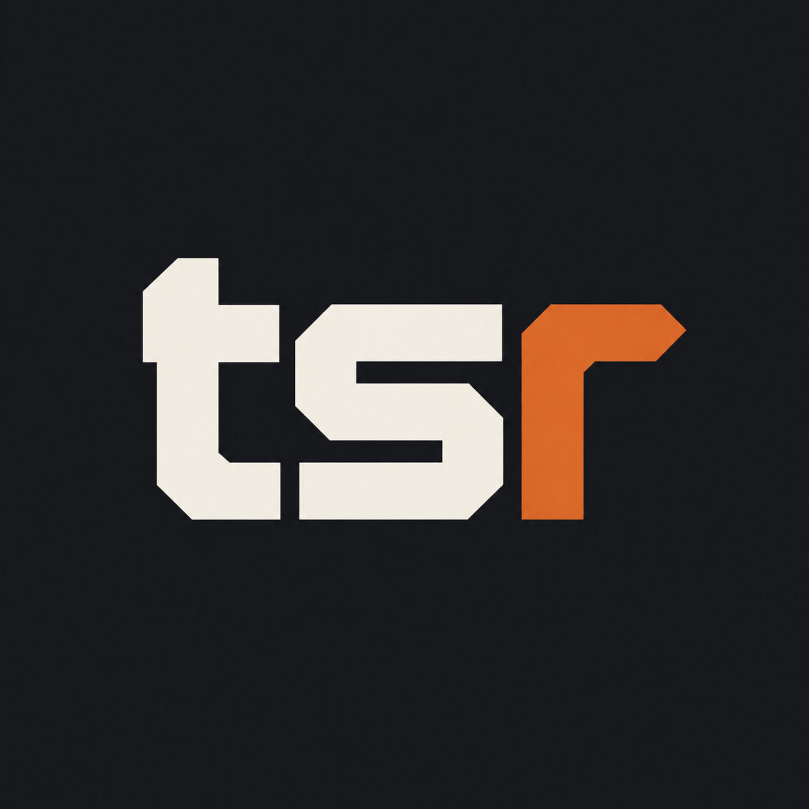

<p align="center">
  
</p>

<h1 align="center">tsr</h1>

<p align="center"><b>TypeScript's native compiler, in Rust.</b><br>
A faithful port of TypeScript 7's Go compiler (Corsa) that passes the same test suites against the same baselines, byte for byte.</p>

<p align="center">
  <a href="https://ferrotype.github.io/tsr/">Status page</a> ·
  <a href="docs/EVIDENCE-plan.md">How parity is tracked</a> ·
  <a href="PLAN.md">The plan</a> ·
  <a href="docs/adr/README.md">Architecture decisions</a>
</p>

---

## What it is

TypeScript 7 moved its compiler to Go (microsoft/TypeScript, module `tsc/`). `tsr` ports that compiler to Rust, function by function, and holds it to the pin's own test corpus: 13,432 compiler and conformance variants, the transpile cases and 516 command-line scenarios, compared whole against the baselines the pin commits. Where the Rust output differs, the difference is named in a committed file and CI fails if it changes.

What you get:

- **`tsrust`** — the compiler command line. The same arguments as `tsc`: a project or a file list, `--incremental`, `--watch`, `-b` with clean, dry, force and build-watch; the same console output, exit statuses, emitted files and `.tsbuildinfo`.
- **A library workspace** of 48 `tsr_*` crates — scanner, parser, binder, checker, transformers, printer, source maps, module resolution, program loading, the build orchestrator and a native file watcher — with ownership modelled on arenas and checked identities instead of a garbage collector, so a checker can be embedded, retained and dropped from Rust.
- **WebAssembly and embedding adapters** (`tsr_wasm`, `tsr_embed`, `tsr_node`), at prototype level until Phase 7.

Why: the Rust tooling TypeScript projects use today stops at syntax. Type-aware tooling in Rust — a usage index, a bundler that knows types, an editor service you can link — needs a checker that answers exactly what TypeScript answers. Porting the compiler the TypeScript team wrote, and keeping it honest against their tests, is the only way to get one.

## Development status

Work is sequenced by dependency, not by calendar (ADR 0005). Each phase closes when the pinned suites it covers pass; the numbers below are what CI measures on every pull request.

| Phase | Scope | State |
|---|---|---|
| 0 | Contracts, scanner, parser, encoder, the arena and ownership model, the test-host transport, spike measurements | Done |
| 1 | Foundations: core, collections, text, JSON, paths, virtual file systems, config and command-line parsing, binder, module resolution | Done |
| 2 | **The checker** — 60,703 lines of Go on the critical path | Done: types, symbols and errors match the pin on every corpus variant |
| 3 | Emit: transformers, printer, source maps, declaration emit, transpile | Done |
| 4 | Programs, command line, build orchestrator, native watcher, watch mode, tracing | Done: `tsrust` |
| 5 | Language service, project system, LSP server | Planned ([docs/PHASE5-plan.md](docs/PHASE5-plan.md)) |
| 6 | JS API server (the `--api` protocol the TypeScript npm package speaks) | Planned |
| 7 | Hardening, WebAssembly and embedding acceptance, cut-over | Planned |

**Measured against the pin today** (`status/parity/`, recomputed by CI):

| Suite | Variants | Result |
|---|---:|---|
| `compiler` (compiler + conformance, the pin's single-threaded mode) | 13,432 | 119,602 sub-tests pass; 13 failing, one enum-literal typing issue |
| `compiler-concurrent` (the production checker pool) | 13,432 | same |
| `transpile` | 28 | all pass |
| `tsc` (command line, `-b`, `--watch`, `--incremental` scenarios) | 516 | 514 match; 2 approved differences in trace event order |

**Performance against Go** (`status/perf/`, the owner's host, September 2026): parse and bind of the VS Code workload at **1.15×** Go's wall time single-threaded and **1.40×** at eight threads, with **0.70×** its peak memory and allocation; the checker query workload at **0.47×** Go's throughput with **0.81×** its per-type memory. The checker's throughput is the open performance item; Phase 7 owns it.

**Port coverage:** 7,538 of 11,485 upstream functions carry a `// port:` marker to their Rust counterpart; the language service, project system and API packages are the unported remainder. The [status page](https://ferrotype.github.io/tsr/) breaks this down by package.

## Try it

Nothing is published yet (the crate names are reserved); build from source. You need the pinned stable Rust toolchain (`rust-toolchain.toml` selects it) and the upstream submodule for the test data.

```bash
git clone --recurse-submodules https://github.com/ferrotype/tsr
cd tsr
cargo build --release -p tsr --bin tsrust
./target/release/tsrust --version        # Version 7.1.0-dev, the pin's
```

```bash
./target/release/tsrust -p path/to/tsconfig.json
./target/release/tsrust app.ts util.ts --target es2022 --module esnext
./target/release/tsrust -b --watch
```

Targets: macOS arm64 and x64, Linux x64 and arm64 (glibc). There is no language server yet; that is Phase 5.

## How it stays honest

- **One upstream pin.** microsoft/TypeScript at `1f70213d4922b434345f639b441681e470c7cfc1` (2026-09-04) is a submodule under `upstream/`; it supplies the test cases, the committed baselines, the lib files, the schemas and the client. Moving the pin means porting the diff against the file ledger (`PORTS.toml`).
- **The pin's test runner, ported.** `crates/tsr_testrunner` is the Rust port of `internal/testrunner`: it parses the test cases, expands their configurations, compiles, composes every baseline the Go runner composes and compares each with `testdata/baselines/reference`. No Go runs in CI, nothing is recorded or replayed.
- **Expectation files.** `status/parity/<suite>.json` names every sub-test that does not pass, with a reason, and `approved` where the owner accepted a difference. CI fails on a new failure and on a listed test that starts passing, so the file is exact for every commit and progress is its diff. [docs/EVIDENCE-plan.md](docs/EVIDENCE-plan.md) is the model; ADR 0023 the decision.
- **Function traceability.** Every ported function carries `// port: tsc/internal/<file>.go:<Func>`; `cargo xtask validate` rejects a marker that names nothing in the pinned inventory (`data/go-functions.tsv`).
- **Architecture decisions** are recorded in [docs/adr/](docs/adr/README.md): node ownership on arenas, file-owned symbols with checker-local merges, order-sensitive output by ported comparators, growth guards for deep recursion, the test-host protocol, the dependency policy.

## Repository map

| Path | Contents |
|---|---|
| `crates/` | The 48 `tsr_*` crates; `crates/tsr` is the `tsrust` binary |
| `upstream/` | The pinned microsoft/TypeScript checkout (submodule) |
| `status/parity/`, `status/perf/` | Expectation files per suite; performance runs per workload |
| `scripts/parity.py`, `scripts/perf.py` | The suite driver and the performance recorder |
| `tools/` | Harnesses: the `tsc` scenario runner, the benchmark workloads, generators |
| `xtask/` | `cargo xtask gen` (code from the pinned schemas), `validate` (ledger and markers), `status` (the rendered page) |
| `docs/` | [PLAN.md](PLAN.md), the per-phase plans and records, ADRs, design notes |
| `PORTS.toml`, `data/go-functions.tsv` | The upstream file ledger and function inventory |

Working in the repository: [CLAUDE.md](CLAUDE.md) has the commands; [AGENTS.md](AGENTS.md) the implementation rules.

## License

Apache License, Version 2.0 ([LICENSE](LICENSE)). tsr is a port of Microsoft's TypeScript compiler, itself Apache-2.0; [NOTICE](NOTICE) carries the attribution. Unless you explicitly state otherwise, any contribution intentionally submitted for inclusion in tsr by you, as defined in the Apache-2.0 license, shall be licensed as above, without any additional terms or conditions.
